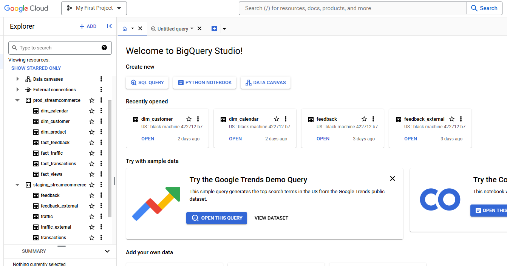

# StreamCommerce Data Pipeline

## Overview

The StreamCommerce data pipeline is designed to process event data in real-time using Apache Kafka and Spark Streaming, followed by batch processing every 10 minutes using Apache Airflow and dbt. The data is stored in Google Cloud Storage (GCS) and BigQuery, enabling efficient data analysis and reporting.

## Architecture

The architecture consists of two main components:
1. **Streaming**: Real-time data ingestion, validation, preprocessing, and storage.
2. **Batch Processing**: Periodic tasks to load data into BigQuery and run transformations.

### Components

- **Events Data**: The source of event data, generated by a Python producer script simulating an e-commerce app. The script sends data to Kafka every 10 seconds.
- **Kafka Cluster**: Hosted on Google Compute Engine using Docker, responsible for handling the data streams.
- **Spark Streaming**: Running on a Dataproc cluster to consume data from Kafka, validate, preprocess, and store it in GCS.
- **Google Cloud Storage (GCS)**: Stores the processed data in Parquet format, partitioned by year, month, day, and hour.
- **Apache Airflow**: Orchestrates the batch processing tasks using Docker.
- **dbt (data build tool)**: Manages data transformations and loads data into the production BigQuery dataset using Docker.
- **BigQuery**: Stores the staging and production datasets for data analysis and reporting.

## Workflow

### Streaming

1. **Event Data Ingestion**:
   - A Python producer script simulates event data from an e-commerce application and sends it to the Kafka cluster every 10 seconds.

2. **Spark Streaming**:
   - Consumes data from Kafka.
   - Performs data validation and preprocessing.
   - Writes data to GCS in a partitioned Parquet format.

### Batch Processing

Every 10 minutes:
1. **Airflow DAGs**:
   - **Create External Table**: Reads data from GCS and creates external tables in BigQuery staging dataset.
   - **Create Native Table**: Converts external tables to native BigQuery tables in the staging dataset.
   - **Insert into Production**: Uses dbt to insert data from staging tables into the production dataset.

### BigQuery Datasets

The BigQuery datasets are organized into staging and production:

- **staging_streamcommerce**:
  - Contains external tables that read data directly from GCS.
  - Holds native tables created from the external tables.
- **prod_streamcommerce**:
  - Contains the final production tables used for reporting and analysis.

## Setup

### Prerequisites

- Google Cloud Project
- Google Cloud Storage Bucket
- Kafka Cluster (Docker)
- Dataproc Cluster
- Apache Airflow (Docker)
- dbt (Docker)
- BigQuery

### Steps

1. **Provision Infrastructure**:
   - Use Terraform to set up Google Cloud resources (GCS, BigQuery, Compute Engine, Dataproc).
   
2. **Configure Kafka**:
   - Set up Kafka brokers and topics on the Compute Engine instances using Docker.
   
3. **Deploy Spark Streaming**:
   - Configure and deploy Spark Streaming jobs on the Dataproc cluster.
   
4. **Set Up Airflow**:
   - Deploy Airflow on a Compute Engine instance using Docker.
   - Define and schedule DAGs for batch processing.
   
5. **Configure dbt**:
   - Define dbt models for data transformations.
   - Set up dbt profiles for BigQuery.
   - Deploy dbt on a Compute Engine instance using Docker.
   
6. **Run the Pipeline**:
   - Start the Python producer script to generate event data and send it to Kafka.
   - Ensure Spark Streaming jobs are running.
   - Monitor Airflow DAGs to verify batch processing.
   - Validate data in BigQuery staging and production datasets.

## Monitoring and Logging

- **Kafka**: Monitor using Confluent Kafka Control Center.
- **Spark Streaming**: Monitor using ssh to dataproc cluter.
- **Airflow**: Monitor DAG runs and task status via Airflow UI.
- **BigQuery**: Validate data loads and transformations using BigQuery Console.

## Contributing

Contributions are welcome! Please open an issue or submit a pull request for any improvements or bug fixes.

## Contact

For any questions or inquiries, please contact [ilhamaulanap@gmail.com](mailto:ilhamaulanap@gmail.com).
